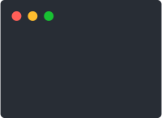

# tty

[](https://github.com/denosaurs/tty/releases)
[](https://github.com/denosaurs/tty/actions)
[](https://github.com/denosaurs/tty/blob/master/LICENSE)

<p align="center">
	<br>
	
	<br>
</p>

```typescript
import * as tty from "https://deno.land/x/tty/mod.ts";

await tty.hideCursor();

let i = 0;

setInterval(() => {
  tty.clearScreenSync();
  tty.goHomeSync();
  console.log(i++);
}, 200);
```

## other

### contribution

Pull request, issues and feedback are very welcome. Code style is formatted with
deno fmt and commit messages are done following Conventional Commits spec.

### licence

Copyright 2020-present, the denosaurs team. All rights reserved. MIT license.
